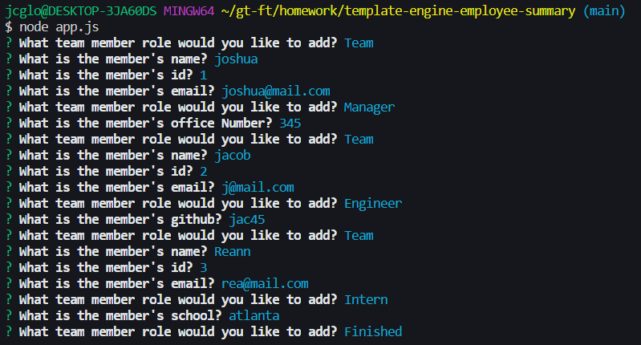

# template-engine-employee-summary

## Description

The goal is for this project is to generate a team of employees derived from various questions. The result should output either a manager, engineer, and/or intern with their respected information.

## Table of Contents

- [Installation](#installation)
- [Usage](#usage)
- [Credits](#credits)
- [License](#license)

## Installation

You need to first install vscode, create a github account, and download git bash for windows. Run "git clone" in git bash to initialize the repository on your computer. Finally, cd into the repository and type "code ." to open it in vscode.

## Usage

 

## Credits

The following people/sites helped contribute to the project.

- [Markdown License badges](https://gist.github.com/lukas-h/2a5d00690736b4c3a7ba)

## License

MIT License

Copyright (c) [2021] [Caleb Glorvigen]

Permission is hereby granted, free of charge, to any person obtaining a copy of this software and associated documentation files (the "Software"), to deal in the Software without restriction, including without limitation the rights to use, copy, modify, merge, publish, distribute, sublicense, and/or sell copies of the Software, and to permit persons to whom the Software is furnished to do so, subject to the following conditions:

The above copyright notice and this permission notice shall be included in all copies or substantial portions of the Software.

THE SOFTWARE IS PROVIDED "AS IS", WITHOUT WARRANTY OF ANY KIND, EXPRESS OR IMPLIED, INCLUDING BUT NOT LIMITED TO THE WARRANTIES OF MERCHANTABILITY, FITNESS FOR A PARTICULAR PURPOSE AND NONINFRINGEMENT. IN NO EVENT SHALL THE AUTHORS OR COPYRIGHT HOLDERS BE LIABLE FOR ANY CLAIM, DAMAGES OR OTHER LIABILITY, WHETHER IN AN ACTION OF CONTRACT, TORT OR OTHERWISE, ARISING FROM, OUT OF OR IN CONNECTION WITH THE SOFTWARE OR THE USE OR OTHER DEALINGS IN THE SOFTWARE.

## Commit
We are not accepting any changes at this time.